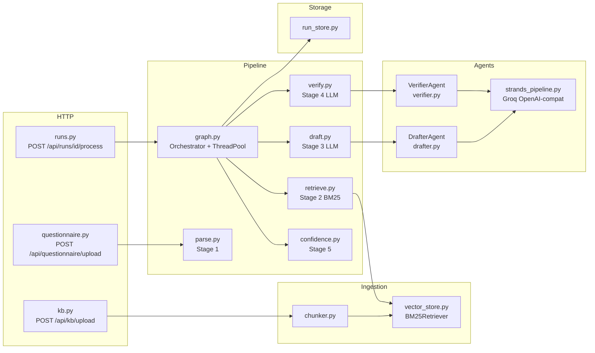
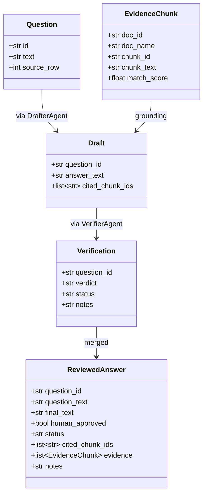
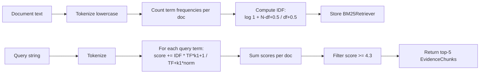
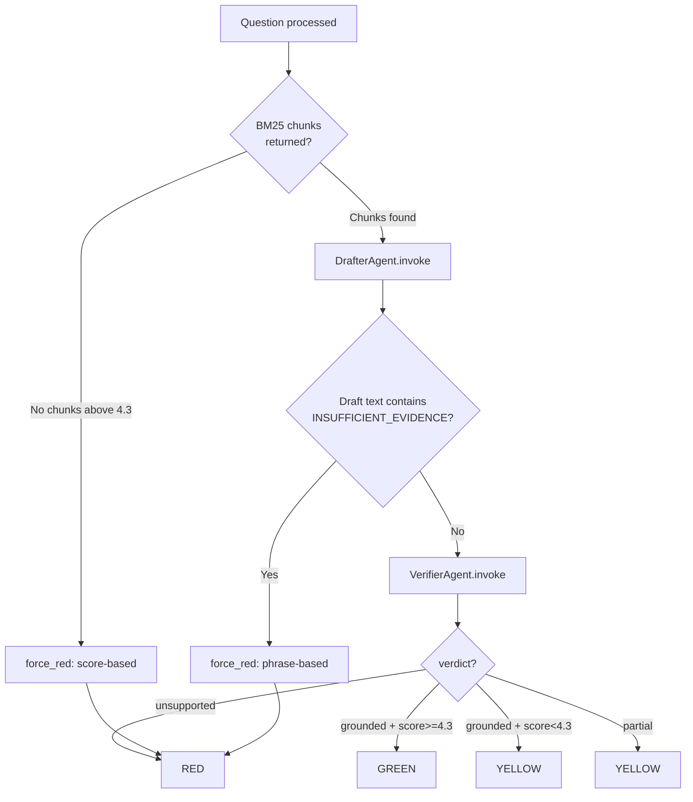

# Groundwork Architecture

## AGENTS.md Spec Compliance

| Spec Requirement | Implementation |
|---|---|
| Two independent agents | DrafterAgent (drafter.py) + VerifierAgent (verifier.py) |
| 5 separable pipeline stages | parse.py, retrieve.py, draft.py, verify.py, confidence.py |
| BM25 retrieval, top-k=5 | vector_store.py — BM25Retriever class |
| Threshold = configured | config.py SIMILARITY_THRESHOLD = 4.3 (empirically set) |
| If empty evidence — auto-red | force_red_if_no_real_evidence() in graph.py before any LLM call |
| Draft system prompt exact | llm/prompts.py DRAFT_SYSTEM_PROMPT |
| Verify system prompt exact | llm/prompts.py VERIFY_SYSTEM_PROMPT |
| Confidence decision table | pipeline/confidence.py compute_status() |
| Never auto-export red | runs.py export route + human_approved flag |
| Strands SDK | strands-agents via OpenAI-compat (Groq) |

---

## Component Map

---

## Data Contracts (frozen field names)

---

## BM25 Algorithm

Parameters: k1=1.5, b=0.75 (standard BM25 defaults)

---

## Confidence Decision Path

---

## API Endpoints

| Method | Route | Handler | Purpose |
|---|---|---|---|
| GET | /health | health.py | Liveness check |
| POST | /api/kb/upload | kb.py | Upload and index a KB document |
| POST | /api/questionnaire/upload | questionnaire.py | Parse a questionnaire into Questions |
| POST | /api/runs/{id}/process | runs.py | Launch pipeline (background) |
| GET | /api/runs/{id}/status | runs.py | Poll progress (done/total) |
| GET | /api/runs/{id}/results | runs.py | Fetch all ReviewedAnswers |
| PATCH | /api/runs/{id}/answers/{qid} | runs.py | Human approval or edit |
| POST | /api/runs/{id}/export | runs.py | Export approved answers to .docx |
| POST | /api/verify-single | main.py | Interactive single-question test |

---

## Eval Numbers (BM25, no LLM required)

Threshold set empirically at 4.3 — sits in the natural gap between:
- Highest red-expected score: q14 at 4.29
- Lowest green-expected score: q1 at 4.35

18/20 correct. The 2 false positives (q15, q20 — physical datacenter) score above threshold because the word "access" appears in the access control policy. They correctly land on yellow, triggering human review. This is the right behavior — a human should confirm whether the KB covers physical security.
