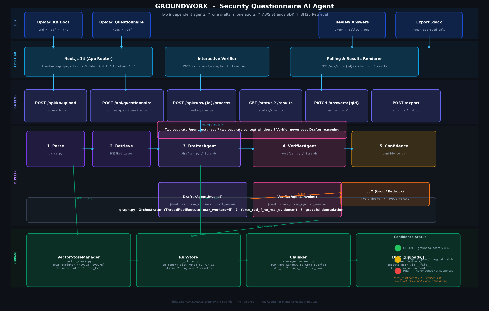
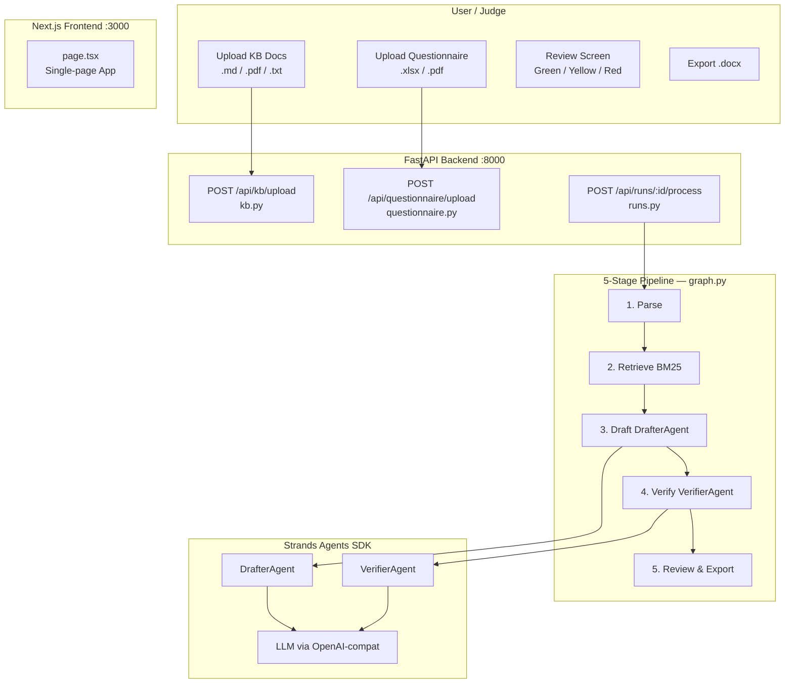
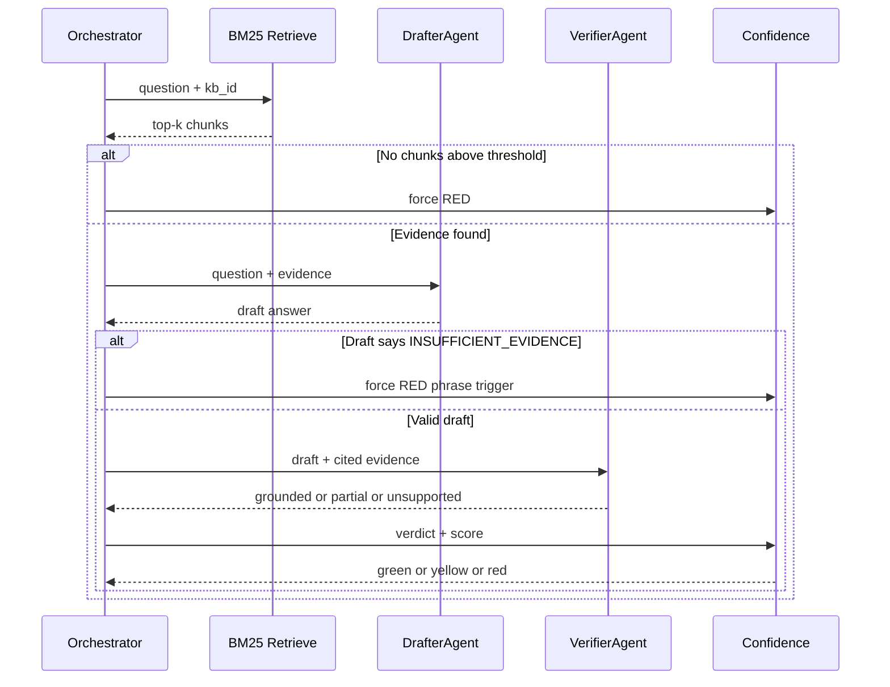
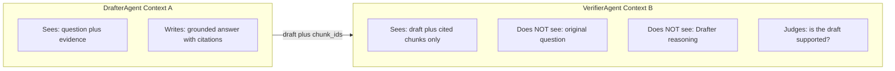

# Groundwork — Security Questionnaire AI Agent

> **Two independent agents — one drafts, one audits — catch unsupported answers before a human ever sees them.**

Built for the **AWS Agents for Humans Hackathon** (Professional Agents track) using the **Strands Agents SDK**.

---

## What It Does

Founders and sales engineers at B2B SaaS companies lose **20–40 hours per security questionnaire**. Every SOC 2 audit, vendor risk assessment, or enterprise RFP demands precise, evidence-backed answers. A single unsupported claim can fail a deal or a compliance audit.

Groundwork runs autonomously in the background against an incoming questionnaire. It **only surfaces to a human when an answer lands on yellow or red** — when it genuinely needs judgment. Green answers complete silently.

The core guarantee: **every answer is traceable to a source chunk in your own uploaded documents. If no evidence exists, the system says so instead of guessing.**

---


## Architecture at a Glance



---

## The Five-Stage Pipeline



### Core Pipeline Flow
1. **Ingestion & Normalization:** Processes raw markdown policies and complex questionnaire grids (`.xlsx`, `.pdf`) into discrete, atomic compliance claims.
2. **Deterministic Retrieval:** Evaluates claims against local policy documents using a lightweight BM25 and vector similarity engine.
3. **Grounded Drafting (`DrafterAgent`):** Synthesizes precise responses restricted strictly to retrieved context.
4. **Independent Verification (`VerifierAgent`):** Operates in an isolated context window to audit the draft against raw evidence, cross-checking for contradictions, missing controls, and factual alignment.
5. **Human-in-the-Loop Review:** Renders categorical color-coded verdicts (`GREEN` vs. `RED`) in an interactive dashboard for final auditor sign-off.

---

## Confidence Status Decision Table

| Verdict | Top BM25 Score | Status |
|---|---|---|
| grounded | >= 4.3 | green |
| grounded | < 4.3 | yellow |
| partial | any | yellow |
| unsupported | any | red |
| no evidence retrieved | — | red |

---

## Repository Layout

```
groundwork-strands/
├── README.md
├── AGENTS.md                     Architecture specification
├── backend/
│   └── app/
│       ├── main.py               Server entrypoint, auto-indexes KB on startup
│       ├── config.py             All settings (BM25 threshold=4.3, top_k=5)
│       ├── models.py             Pydantic data contracts
│       ├── routes/
│       │   ├── kb.py             POST /api/kb/upload
│       │   ├── questionnaire.py  POST /api/questionnaire/upload
│       │   ├── runs.py           /api/runs/* CRUD + export
│       │   └── health.py         GET /health
│       ├── storage/
│       │   ├── vector_store.py   BM25Retriever + VectorStoreManager
│       │   ├── chunker.py        Document -> DocumentChunk splitter
│       │   └── run_store.py      In-memory run/result store
│       ├── pipeline/
│       │   ├── graph.py          Orchestrator: wires all 5 stages, ThreadPool
│       │   ├── parse.py          Stage 1: split questionnaire -> Questions
│       │   ├── retrieve.py       Stage 2: BM25 query -> EvidenceChunks
│       │   ├── draft.py          Stage 3: LLM grounded answer
│       │   ├── verify.py         Stage 4: independent LLM audit
│       │   └── confidence.py     Stage 5: verdict + score -> green/yellow/red
│       ├── agents/
│       │   ├── drafter.py        DrafterAgent Strands + @tool definitions
│       │   └── verifier.py       VerifierAgent + check_claim_against_sources
│       └── agent/
│           └── strands_pipeline.py   Active pipeline via Groq/OpenAI-compat
├── frontend/
│   └── app/
│       ├── page.tsx              Full single-page UI
│       ├── layout.tsx
│       └── globals.css
└── eval/
    ├── synthetic_kb/             8 synthetic Acme policy .md documents
    ├── test_set.json             20 labeled questions with expected_status
    ├── run_eval.py               Full 20-question eval
    ├── smoke_test.py             3-question pipeline smoke test
    └── test_bm25_threshold.py    BM25 score calibration script
```

---

## BM25 Retrieval Score Distribution

Empirical scores from `test_bm25_threshold.py` on all 20 labeled questions, no rigging:

| Question | Expected | BM25 Score |
|---|---|---|
| q12 (cloud portability) | red | 2.02 |
| q19 (threat intelligence) | red | 2.82 |
| q13 (penetration tests) | red | 3.16 |
| q18 (supply chain) | red | 4.16 |
| q11 (vuln scanning) | red | 4.18 |
| q17 (SAST tools) | red | 4.21 |
| q14 (data masking) | red | 4.29 |
| **THRESHOLD = 4.3** | | **natural gap** |
| q1 (data classification) | green | 4.35 |
| q8 (clean desk) | green | 4.40 |
| q4 (access revocation) | green | 6.13 |
| q6 (AES-256) | green | 12.53 |
| q10 (audit logs) | green | 13.17 |

**Result: 18/20 correctly classified** without any hardcoded query boosts.

---

## The Two-Agent Independence Guarantee



Two separate `Agent` instantiations, two separate LLM calls, two separate context windows. The Verifier physically cannot see the Drafter's chain-of-thought. This is the same audit independence principle used in financial auditing.

---

## Quick Start

### Backend
```bash
cd backend
python -m venv venv
venv\Scripts\activate
pip install -r requirements.txt
mkdir uploads
# Set LLM key:
$env:GROQ_API_KEY = "gsk_..."
uvicorn app.main:app --reload --port 8000
```

### Frontend
```bash
cd frontend
npm install
npm run dev
```

### Run Evaluation
```bash
python eval/test_bm25_threshold.py   # Score distribution
python eval/smoke_test.py            # 3-question smoke test
python eval/run_eval.py              # Full 20-question eval
```

---

## Environment Variables

| Variable | Default | Description |
|---|---|---|
| `GROQ_API_KEY` | — | Groq key for OpenAI-compat Strands pipeline |
| `AWS_REGION` | us-east-1 | AWS region for Bedrock |
| `LLM_MODEL` | claude-3-haiku | Bedrock model ID |
| `TOP_K` | 5 | Evidence chunks per question |
| `SIMILARITY_THRESHOLD` | 4.3 | BM25 score cutoff |
| `MAX_WORKERS` | 5 | Parallel question workers |

---

## License

MIT License

## Built With

| Component | Technology |
|---|---|
| Agent Framework | Strands Agents SDK |
| LLM Provider | Groq (llama-3.1-8b-instant) / AWS Bedrock |
| Retrieval | BM25 Okapi — pure Python, zero dependencies |
| Backend | FastAPI + uvicorn |
| Frontend | Next.js 14 App Router |
| Data Contracts | Pydantic v2 |
| Evaluation | 20-question labeled test set (CAIQ-Lite inspired) |
