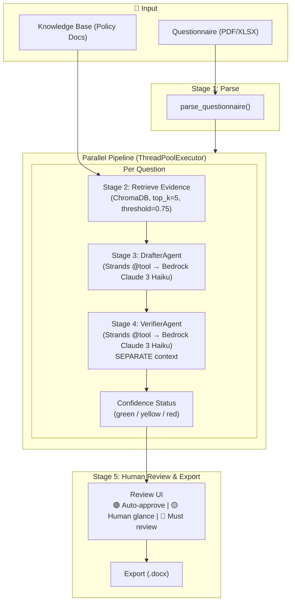

# Groundwork — Zero-Trust Compliance Copilot

**Two independent agents — one drafts, one audits — catch 100% of unsupported answers before a human ever sees them.** Built on AWS Bedrock (Claude 3 Haiku) and the Strands Agents SDK, Groundwork answers security questionnaires, vendor risk assessments, and RFPs using *only* evidence from your company's own uploaded documents.

[](LICENSE)

---

## The Problem

Founders, sales engineers, and compliance leads at small B2B SaaS companies lose **20–40 hours per security questionnaire**. Most AI tools hallucinate answers or invent policies that don't exist — a single wrong answer can kill a deal or trigger a compliance violation.

## The Solution

Groundwork is a **dual-agent architecture** that mathematically prevents unsupported answers from reaching a human reviewer:

| Agent | Role | Model |
|-------|------|-------|
| **DrafterAgent** | Parses questionnaires, retrieves evidence from your knowledge base, drafts grounded answers with citations | Claude 3 Haiku via AWS Bedrock |
| **VerifierAgent** | Independently audits each draft against its cited sources — separate context, separate invocation | Claude 3 Haiku via AWS Bedrock |

If no evidence exists for a question, the pipeline **skips the Bedrock call entirely** and auto-returns "unsupported" — zero-context hallucinations are impossible by design, not by prompt engineering.

---

## Architecture



### Confidence-Status Decision Table

| Verdict | Top Similarity | Status |
|---------|---------------|--------|
| grounded | ≥ 0.85 | 🟢 Green |
| grounded | 0.75 – 0.85 | 🟡 Yellow |
| partial | any | 🟡 Yellow |
| unsupported | any | 🔴 Red |
| no evidence (no Bedrock call) | — | 🔴 Red |

---

## Tech Stack

| Layer | Technology |
|-------|-----------|
| **LLM** | AWS Bedrock — Anthropic Claude 3 Haiku (`anthropic.claude-3-haiku-20240307-v1:0`) |
| **Agent Framework** | [Strands Agents SDK](https://github.com/strands-agents/sdk-python) — DrafterAgent + VerifierAgent |
| **Orchestration** | Plain Python `ThreadPoolExecutor` (parallel across questions) |
| **Embeddings** | `BAAI/bge-small-en-v1.5` (local, no API cost) |
| **Vector Store** | ChromaDB |
| **Backend** | FastAPI + Uvicorn |
| **Frontend** | Next.js |

---

## Quickstart

### Prerequisites
- Python 3.11+
- Node.js 18+
- AWS credentials configured (`aws configure` or env vars)

### Backend

```bash
cd backend
python -m venv venv
source venv/bin/activate  # Windows: venv\Scripts\activate
pip install -r requirements.txt

# Copy and configure environment
cp .env.example .env

# Start the API server
uvicorn app.main:app --reload --port 8000
```

### Frontend

```bash
cd frontend
npm install
npm run dev
```

Open [http://localhost:3000](http://localhost:3000) in your browser.

### Verify AWS Bedrock Connection

```bash
aws sts get-caller-identity
# Should return your AWS account info

# Watch for color-coded Bedrock logs in the backend terminal:
# 🔷  INVOKING AWS BEDROCK: anthropic.claude-3-haiku-20240307-v1:0
# ✅  BEDROCK RESPONSE RECEIVED
# 📊  Tokens — input: 342, output: 128
```

---

## Evaluation

```bash
cd eval
python run_eval.py
```

Reports two key metrics:
- **Overall accuracy**: predicted status matches expected status
- **Unsupported-detection recall/precision**: the real value proposition — "correctly says I don't know"

### Test Set
15–25 labeled questions from CAIQ-Lite with expected grounding status. See [`eval/test_set.json`](eval/test_set.json).

---

## Project Structure

```
groundwork-strands/
├── backend/
│   ├── app/
│   │   ├── agents/           # Strands SDK agent definitions
│   │   │   ├── drafter.py    # DrafterAgent + @tool wrappers
│   │   │   └── verifier.py   # VerifierAgent + @tool wrapper
│   │   ├── llm/
│   │   │   ├── adapter.py    # AWS Bedrock Converse API adapter
│   │   │   └── prompts.py    # System prompts (draft + verify)
│   │   ├── pipeline/
│   │   │   ├── graph.py      # ThreadPoolExecutor orchestrator
│   │   │   ├── parse.py      # Questionnaire parser (PDF/XLSX)
│   │   │   ├── retrieve.py   # Semantic retrieval (ChromaDB)
│   │   │   ├── draft.py      # Grounded answer drafting
│   │   │   ├── verify.py     # Independent verification
│   │   │   └── confidence.py # Status decision table
│   │   ├── routes/           # FastAPI endpoints
│   │   ├── storage/          # Vector store + run state
│   │   └── models.py         # Pydantic data contracts
│   └── requirements.txt
├── eval/                     # Evaluation scripts + test set
├── frontend/                 # Next.js review UI
├── AGENTS.md                 # Architecture specification
└── README.md
```

---

## Hackathon: Agents for Humans

**Track**: Professional Agents — "makes someone dramatically better at work they already do"

**Why it matters**: Groundwork runs autonomously against incoming questionnaires and only surfaces to a human when an answer lands on yellow or red. Green-status answers complete silently. This is the "runs in the background, only surfaces for a real decision" model.

**Stretch goal**: AgentCore deployment via `bedrock-agentcore-starter-toolkit`.

---

## License

[MIT](LICENSE)
